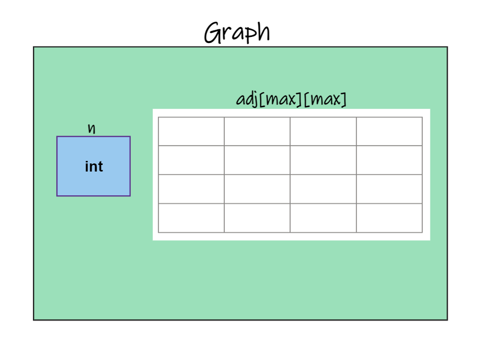

# ***Implementation Using Adjacency Matrix***  


## <p align="center"><em>Structure of Graph</em></p>
---
~~~c 
typedef struct graph
{
    int n;
    int adj[MAX][MAX];
} graph;
~~~
- visual representation of the structure  
  

      

    ***n ==> no. of vertices  
    MAX ==> user defined macro*** 

    Graph is a data structure which has two members:   
       
    * A 2D matrix where ( i , j )<sup>th</sup> index value is the flag which tells wether there is a path form *i to j* or not.  
            For example :  

            if  (adj [2][3]==1) is true    
                This means there is a path from 2 to 3.
    * An integer value that tells up number of vertex in the graph.


* Accessing members of the Structure  

    - For example if we create a pointer to the structure lets say 
        ~~~c 
        graph *adj_matrix= (graph*)malloc(sizeof(graph));
        ~~~

        then in order to access members of the structure we have to use pointer convention like

        ~~~c
        adj_matrix -> n = 50;
        adj_matrix -> adj[i][j] = 69
        ~~~

        ``` This is becuase adj_matrix is a pointer to the whole strucutre but and that structure has two members adj which is a matrix and the other one is n which is the number of vertices```  
<br>  

        
        <br>  
        ``` If it is still confusing then think of it like you created a pointer to a node to access the data and the link part```

        Here :  
        ``` 
        node -> data = 3;
        graph -> n = 3;

        And 

        graph -> adj[i][j]= 69;
        node -> link = new_node;
        ```

        > Note :  
        The above snippets are not equivalent statements they are just to make you understand how pointer works here  
            
        ***graph*** is used in above example but in practice ***graph*** is the name of the data strucutre so we use ***adj_matrix*** as the pointer variable of the data structure "Graph".  
        <br>
---  

## <p align="center"><em>ADT OF GRAPHS</em></p>  
---

* Creating a Graph
* Displaying a Graph
* Calulating Indegree
* Calulating Outdegree
* Traversal
___ 

### <p align ="center">Creating a graph</p>
~~~c
void create_graph(graph *adj_matrix)
{
    int i , j;

    for (i=0 ; i< adj_matrix ->n ;i++)
    {
        for ( j=0 ; j< adj_matrix ->n ; j++)
        {
            adj_matrix-> adj[i][j]=0;
        }
    }

    while(1)
    {
        printf("Enter the source and Destination position");   
        scanf("%d%d", &i , &j);
        if( i< 0 || j < 0|| i> MAX || j > MAX)
        {
            break;
        }
        adj_matrix-> adj[i][j];
    }
}
~~~
The above code can be broken down into two small parts  
- First where we are initializing the matrix with 0 this step can be avoided by doing this step while creating the structure.

- Second where we are asking for source and destination and if the value of source and destination are valid we make the set the array( i , j ) index as 1.  
<br>  

___
<br>  

### <p align ="center">Displaying the contents of the graph</p>  

<br>  

~~~c
void display()
{
    for(int i=0 ; i< adj_matrix -> n ; i++)
    {
        for( int j =0 ; j< adj_matrix -> n ;j++)

        {
            printf("%d \t" adj_matrix->adj[i][j]);
        }
    }
}
~~~

 At first it might look a bit intimidating but its basically displaying the contents of a double dimensional array which is easy as we are taking two loops one nested inside other and we print all the elements in the 2D array.  

 *0* means that there **is no path** between *vertex i and vertex  j*

 *1* means there **is path** between *vertex i and vertex j.*

<br>  

___
<br>  

### <p align ="center">Calculating **Indegree**</p>  

<br>  

*Indegree of a Vertex* is the ***number of paths leading*** to the ***Vertex***.  

~~~c
int indegree(graph *adj_matrix , int v)
{
    int count =0 ;
    for(int i =0; i< adj_matrix-> n;i++)
    {
        if( adj_matrix -> adj[i][v]==1 )
        {
            count++;
        }
    }
}
~~~

*adj [ i ][ v ]* means *from index i to index v* ,  if there is a path from *index i to index v* then ***adj [ i ][ v ] will be 1*** . That is approach behind calculating indegree.
___
<br>  

### <p align ="center">Calculating **Outdegree**</p>


*Outdegree of a Vertex* is the ***number of paths leading away*** from the ***Vertex***.
~~~c
int outdegree(graph *adj_matrix , int v)
{
    int count =0 ;
    for(int i =0; i< adj_matrix-> n;i++)
    {
        if(adj_matrix ->adj[v][i]==1)
        {
            count++;
        }
    }
}
~~~
Similar to Indegree we calulate Outdegree.  
<br>


>Note :  
For Undirected Graphs Both Indegree And Outdegree are same.

<br>

___
<br>  

### <p align ="center">**Traversal Methods**</p>
### <p align ="center">*BFS: BREADTH FIRST SEARCH*</p>

* Pre -requisites :  
    - How Queues works,   
    - How BFS works, 


* BFS ALGOTRITHM  
    * Select a Starting vertex for BFS and enqueue it to the queue.
    * Visit *all Adjacent vertices*.
    * if any of the adjacent vertex *is unvisited* *make it visited* then *enqueue it to the queue*. 
    * While the *queue is not empty* dequeue a element from the queue and *repeat the above two statements* with dequeued element at starting vertex.


~~~c
void bfs ( int matrix [][] , int vertex , int n)
{
    int visited[n]= { 0 };
    int queue[n];
    int rear = -1 ,front = 0;

    visited[vertex] = 1 ;
    queue[++rear] = vertex ;
    
    while ( front < = rear )
    {
        vertex = queue[front++];
        for( int i = 0 ; i< n ; i++)
        {
            if( matrix [vertex][i]==1 )
            {
                if( visited [i] == 0)
                {
                    visited [i] =1 ;
                    printf(" Vertex %d is visited ", i);
                    queue[++rear]=i;
                }
            }
        }
    }
}
~~~

Lets Try To understand the code :  
~~~c 
void bfs ( int matrix [][] , int vertex , int n)
~~~

Our Function takes Three Arguments :
* **int matrix[ ][ ]** : The Adjacency Matrix 
* **int vertex** : The Starting Vertex 
* **int n** : The number of Vertices 

~~~c
int visited[n]= { 0 };
int queue[n];
int rear = -1 ,front = 0;
~~~

We are creating :  
- A visited array of size n with initialized values as 0 , which we will use to keep track which all vertices have been visited.

- A queue with rear and front for bfs traversal.

~~~c
visited[vertex] = 1 ;
queue[++rear] = vertex ;
~~~
Marking the Vertex as Visited and enqueuing it to the queue.

~~~c
while ( front < = rear )
    {
        vertex = queue[front++];
        for( int i = 0 ; i< n ; i++)
        {
            if( matrix [vertex][i]==1 )
            {
                if( visited [i] == 0)
                {
                    visited [i] =1 ;
                    printf(" Vertex %d is visited ", i);
                    queue[++rear]=i;
                }
            }
        }
    }
~~~

* While queue is not empty 
* Dequeue an element from the queue and store it to the vertex. 
* a for loop for all the vertices in the matrix.
* if ( matrix [ vertex ][ i ] == 1 ) this statement is adjacent vertex finder.   
That means if there is a path from *vertex to i* and if the *visited for the i is 0* that means ***i is an unvisited adjacent vertex*** so we *print it* and *enqueue to the queue.*

