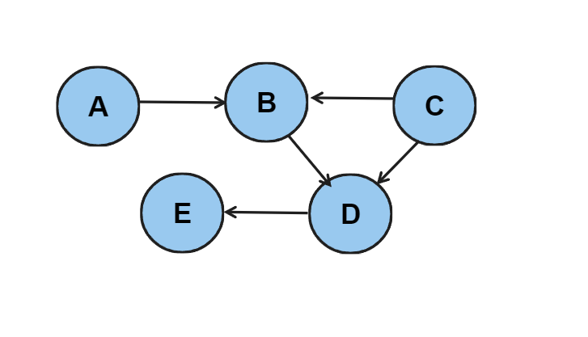

# Graphs 

> What are Graphs ?

* Graphs are ***non linear*** data data structures
* Which have set of Vertices (node) & edges 
* G = (V, E)
* Graphs can be implemented by :  
    * Adjacency Matrix
    * Linked list 

##  __Types of Graphs__

``` Graphs are of two types : ```  
<br>
### <p align="center">*Undirected graphs*</p>
    Well you can think of undirected graphs as cities which are connected to each other,  you have a road from CITY A to CITY B ; but you can take the same road to come form CITY B to CITY A .    


```Here is a representation of The Graphs as Adjacency Matrix```

|  | A | B | C | D | E |
|:-:|---|---|---|---|---|
| A | 0 | 1 | 0 | 0 | 0 |
| B | 1 | 0 | 1 | 1 | 1 |
| C | 0 | 1 | 0 | 1 | 0 |
| D | 0 | 1 | 1 | 0 | 1 |
| E | 0 | 1 | 0 | 1 | 0 |


~~~ 
a[i,j] = {
            1   if ( i -> j)
            0   otherwise
         }


In an adjacency matrix a[i,j] signifies that there is a path from vertex i to vertex j 
~~~


```Here is a representation of The Graphs as Adjacency List or linked list```


### <p align="center">*Directed graphs*</p>

    Directed Graphs are more like a cliff and a Valley like you come down from the cliff but you cant go up from valley

    Or you can say its One Sided like your feelings for your crush



```Here is a representation of The Graphs as Adjacency Matrix```

|  | A | B | C | D | E |
|:-:|---|---|---|---|---|
| A | 0 | 1 | 0 | 0 | 0 |
| B | 0 | 0 | 0 | 1 | 0 |
| C | 0 | 1 | 0 | 1 | 0 |
| D | 0 | 0 | 0 | 0 | 1 |
| E | 0 | 0 | 0 | 0 | 0 |

```Here is a representation of The Graphs as Adjacency List or Linked list```


#### Terminologies Important : 
---

* Adjacency 
    * Two nodes are Adjacent if connected by an edge  

        

    Here A and B are adjacent to each other

* Successor and Predessor 

    * In Directed Graphs there are successor and predessor  
    

* Paths 

    * Paths are Basically the road which you can take to reach a specific point
    

    ```In this figure, if i have to reach D from A``` 

    ```
    A -> B -> C -> D  
    A -> B -> E -> D  
    A -> B -> D  
    ```
    These are the Paths that you can choose.

* Cycle

    * Graphs with atleast 1 are called cyclic graph .
    

    ```This is a cyclic graph due to B D E ```

* Acyclic 
    
    * Reverse of Cyclic 

        > A directed acyclic graph is called a DAG  

        


* Degree of a Vertex 

    * No . of Edges Connected to **Vertex**.

        * Indegree  
            - Number of incoming Edges

        * OutDegree  
            - Number of Outgoing Edges


---
***<p align="center">Thats All for Theory</p>***  

---


