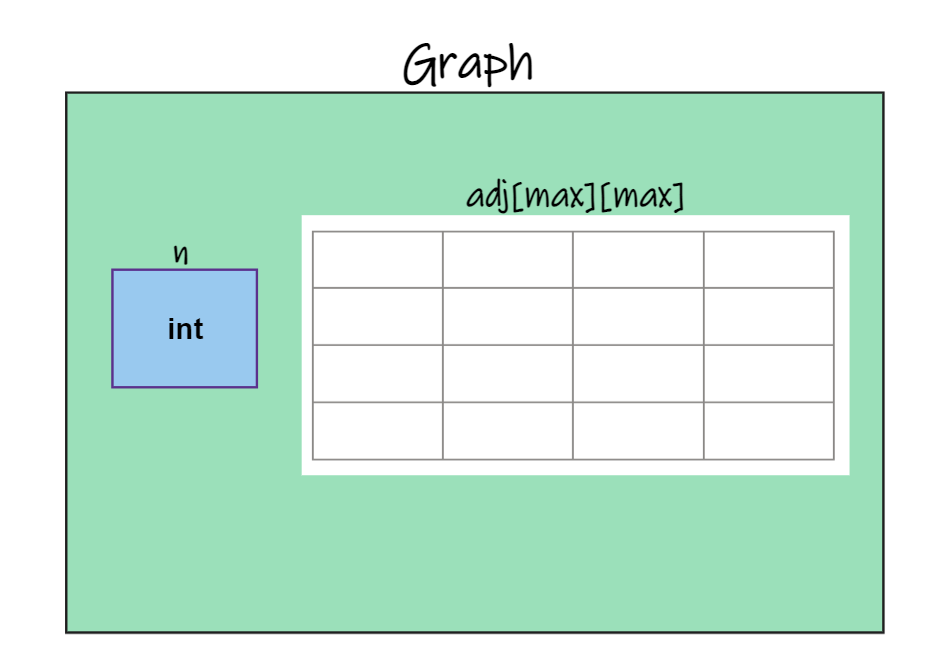
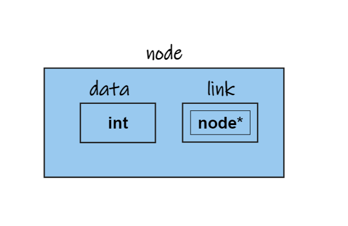

# ***Implementation Using Adjacency Matrix***  
---
<br>

```Structure of the graphs```
~~~c
typedef struct graph{
    int n;
    int adj[MAX][MAX];
}graph;
~~~
- here is a visual representation of the structure 
  
***n ==> no. of vertices  
MAX ==> user defined macro***  

- For example if we create a pointer to the structure lets say 
    ~~~c 
    graph *adj_matrix= (graph*)malloc(sizeof(graph));
    ~~~

    then in order to access members of the structure we have to use pointer notation like

    ~~~c
    adj_matrix -> n = 50;
    adj_matrix -> adj[i][j] = 69
    ~~~

    ``` This is becuase adj_matrix is a pointer to the whole strucutre but and that structure has two members adj which is a matrix and the other one is n which is the number of nodes```

    ``` If it is still confusing then think of it like you created a pointer to a node to access the data and the link part```

     

    Here :  
    ``` 
        graph -> n = 3;
        node -> data = 3;

        And 

        graph -> adj[i][j]= 69;
        node -> link = new_node
    ```

    > Note :  
       The above snippets are not equivalent statements they are just to make you understand how pointer works here  
       >> graph is used in above example but in practice graph is the name of the data strucutre so we use adj_matrix as the name of the data structure.

### Creating a graph
~~~c
void create_graph(graph *adj_matrix)
{
    int i , j;

    // initializing values to 0

    for (i=0 ; i< adj_matrix ->n ;i++)
    {
        for ( j=0 ; j< adj_matrix ->n ; j++)
        {
            adj_matrix-> adj[i][j]=0;
        }
    }

    while(1)
    {
        printf("Enter the source and Destination position");
            
        scanf("%d%d", &i , &j);
        
        if( i< 0 || j < 0|| i> MAX || j > MAX)
        {
            adj_matrix-> adj[i][j];
        }
    }
}
~~~


### Displaying the contents of the graph
~~~c
void display()
{
    for(int i=0 ; i< adj_matrix -> n ; i++)
    {
        for( int j =0 ; j< adj_matrix -> n ;j++)

        {
            printf("%d \t" adj_matrix->adj[i][j]);
        }
    }
}
~~~

``` At first it might look a bit intimidating but its basicaaly displaying the contents of a double dimensional array which is easy as we are take two loops one nested inside other and we print all the elements in array ```


### Calcualting **Indegree**

Indegree of a Vertex is the number of paths leading to the particular node.  

~~~c
int indegree(graph *adj_matrix , int v)
{
    int count =0 ;
    for(int i =0; i< adj_matrix-> n;i++)
    {
        if( adj_matrix -> adj[i][v]==1 )
        {
            count++;
        }
    }
}
~~~


### Calcualting **Outdegree**

Outdegree of a Vertex is the number of paths leading away from the nodes.  

~~~c
int outdegree(graph *adj_matrix , int v)
{
    int count =0 ;
    for(int i =0; i< adj_matrix-> n;i++)
    {
        if(adj_matrix ->adj[v][i]==1)
        {
            count++;
        }
    }
}
~~~


>For Undirected Graphs Both Indegree And Outdegree are same.