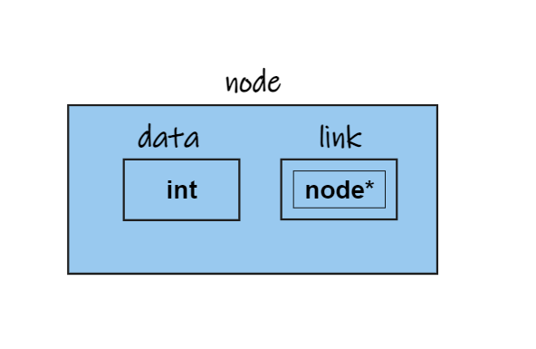
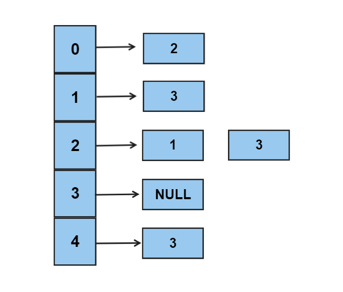

# ***Implementation Using Adjacency Matrix***  


## <p align="center"><em>Structure of Graph</em></p>
---
~~~c 
typedef struct graph
{
    int n;
    int adj[MAX][MAX];
} graph;
~~~
- here is a visual representation of the structure  
  

      

    ***n ==> no. of vertices  
    MAX ==> user defined macro***  

- For example if we create a pointer to the structure lets say 
    ~~~c 
    graph *adj_matrix= (graph*)malloc(sizeof(graph));
    ~~~

    then in order to access members of the structure we have to use pointer notation like

    ~~~c
    adj_matrix -> n = 50;
    adj_matrix -> adj[i][j] = 69
    ~~~

    ``` This is becuase adj_matrix is a pointer to the whole strucutre but and that structure has two members adj which is a matrix and the other one is n which is the number of vertices```

    ``` If it is still confusing then think of it like you created a pointer to a node to access the data and the link part```

     

    Here :  
    ``` 
        graph -> n = 3;
        node -> data = 3;

        And 

        graph -> adj[i][j]= 69;
        node -> link = new_node
    ```

    > Note :  
       The above snippets are not equivalent statements they are just to make you understand how pointer works here  
        
    graph is used in above example but in practice graph is the name of the data strucutre so we use adj_matrix as the name of the data structure.
---  

## <p align="center"><em>ADT OF GRAPHS</em></p>  
---

* Creating a Graph
* Displaying a Graph
* Calulating Indegree
* Calulating Outdegree

___ 

### <p align ="center">Creating a graph</p>
~~~c
void create_graph(graph *adj_matrix)
{
    int i , j;

    for (i=0 ; i< adj_matrix ->n ;i++)
    {
        for ( j=0 ; j< adj_matrix ->n ; j++)
        {
            adj_matrix-> adj[i][j]=0;
        }
    }

    while(1)
    {
        printf("Enter the source and Destination position");   
        scanf("%d%d", &i , &j);
        if( i< 0 || j < 0|| i> MAX || j > MAX)
        {
            break;
        }
        adj_matrix-> adj[i][j];
    }
}
~~~
The above code can be broken down into two small parts  
- First where we are initializing the matrix with 0 this step can be avoided by doing this step while creating the structure.

- Second where we are asking for source and destination and if the value of source and destination are valid we make the set the a(i,j) index as 1.  
<br>  

___
<br>  

### <p align ="center">Displaying the contents of the graph</p>  

<br>  

~~~c
void display()
{
    for(int i=0 ; i< adj_matrix -> n ; i++)
    {
        for( int j =0 ; j< adj_matrix -> n ;j++)

        {
            printf("%d \t" adj_matrix->adj[i][j]);
        }
    }
}
~~~

``` At first it might look a bit intimidating but its basicaaly displaying the contents of a double dimensional array which is easy as we are take two loops one nested inside other and we print all the elements in array ```

<br>  

___
<br>  

### <p align ="center">Calcualting **Indegree**</p>  

<br>  

Indegree of a Vertex is the number of paths leading to the particular node.  

~~~c
int indegree(graph *adj_matrix , int v)
{
    int count =0 ;
    for(int i =0; i< adj_matrix-> n;i++)
    {
        if( adj_matrix -> adj[i][v]==1 )
        {
            count++;
        }
    }
}
~~~

___
<br>  

### <p align ="center">Calcualting **Outdegree**</p>


Outdegree of a Vertex is the number of paths leading away from the nodes.  

~~~c
int outdegree(graph *adj_matrix , int v)
{
    int count =0 ;
    for(int i =0; i< adj_matrix-> n;i++)
    {
        if(adj_matrix ->adj[v][i]==1)
        {
            count++;
        }
    }
}
~~~


>Note :  
For Undirected Graphs Both Indegree And Outdegree are same.


<br>  
<br>  


# ***Implementation Using Adjacency List*** 

## <p align="center"><em>Structure of Graph</em></structurep>
---
~~~c 
typedef struct node
{
    int data;
    struct node* link;
} node;
~~~

- here is a visual representation of the structure  
  

      

    ***data ==> Name of the Vertex  
    link ==> node pointer to next pointer*** 

<br>  

First we Create an array of pointers to structures

```c
node* a[MAX];
```


Every index now acts like a vertex and we chain the nodes which are connected to the vertex with the index.
___

## <p align="center"><em>ADT OF GRAPHS</em></p>  
---

* Creating a Graph
* Displaying a Graph
* Calulating Indegree
* Calulating Outdegree

___ 
<br>

### <p align ="center">Creating a graph</p>

~~~c
void create ( node* a[], int n)
{
    int i , j;
    for(i =0 ; i<n;i++)
    {
        a[i]=NULL;
    }
    while(1)
    {
        printf("Enter the source and destination");
        scanf("%d %d" , &i, &j);
        if(i<0|| j<0|| i>=n || j>=n)
        {
            break;
        }
        insert(a,i,j);
    }
}
~~~

*Understanding the code by breaking it into segments*

- First part  

    ~~~c
        int i , j;
        for(i =0 ; i<n;i++)
        {
            a[i]=NULL;
        }
    ~~~
        The first part of the funciton is setting each array index position as NULL.  
<br>  

- Second part  

    ~~~c
    while(1)
    {
        printf("Enter the source and destination");
        scanf("%d %d" , &i, &j);
        if(i<0|| j<0|| i>=n || j>=n)
        {
            break;
        }
        insert(a,i,j);
    }   
    ~~~
    The second part of the function takes source and destination and if they are valid it calls the insert function with source and destination

``` Create Fucntion is a Helper Fucntion to insert fucntion```


#### *Insert function*  

~~~c
void insert (node * a[], int i , int j)
{
    node* temp = (node*)malloc(sizeof(node));
    temp-> data = j;
    temp->link =NULL;

    node* cur = a[i];
    if( cur->link ==NULL)
    {
        a[i]=temp;
        return;
    }

    while(cur->link!=NULL)
    {
        cur=cur->link;
    }

    cur->link=temp;
}
~~~


Lets try to Understand the code by breaking it into segments

- Part 1 : ***Creating a new node***

    ~~~c
    node* temp = (node*)malloc(sizeof(node));
    temp-> data = j;
    temp->link =NULL;
    ~~~
    The above Part creates a node and assign the destination as the value of the node

- Part 2 :  ***Insert at Rear in Singly Linked List***  
    -   Check for empty list  

        ~~~c
        node* cur = a[i];
        if( cur ==NULL)
        {
            a[i]=temp;
            return;
        }
        ~~~

        We check if the if index is pointingto NULL that means the list is emptyso the node we just created willbecome the head of the list.

    - Insert anywhere else

        ~~~c
        while(cur->link!=NULL)
        {
            cur=cur->link;
        }
        cur->link=temp;
        ~~~

        


